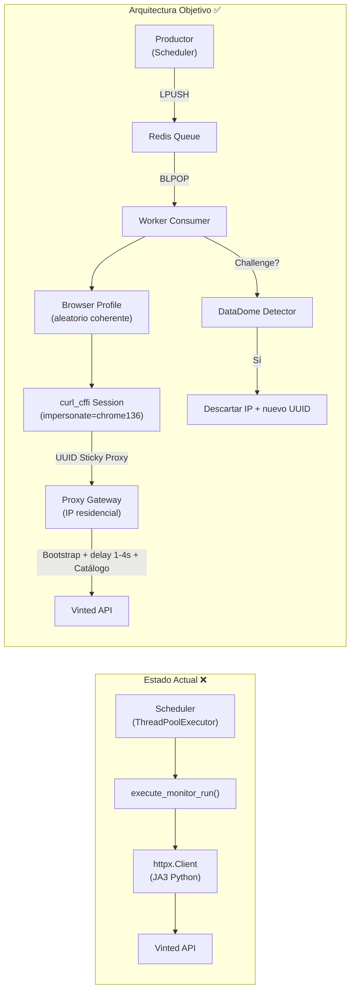
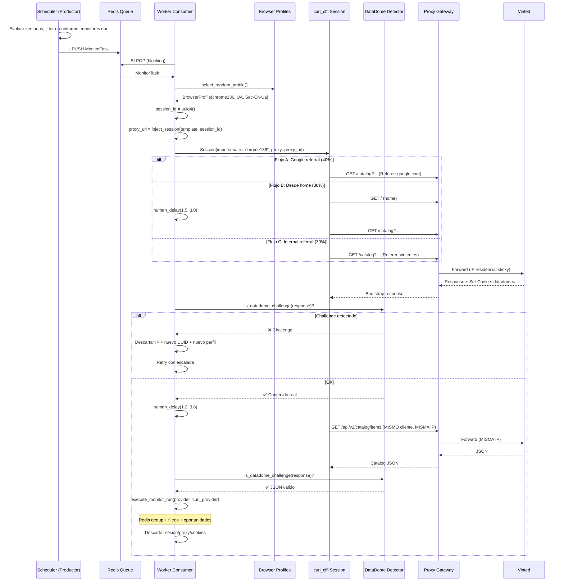

# Refactorización: Arquitectura Productor-Consumidor con Bypass DataDome Endurecido

## Resumen

Migrar la arquitectura del worker de un modelo síncrono-acoplado (scheduler → `execute_monitor_run` → `httpx` directo) a un patrón **Productor-Consumidor** con cola Redis, usando `curl_cffi` para TLS fingerprint bypass y proxies residenciales con sesiones sticky dinámicas (UUID por tarea), con **10 capas de endurecimiento anti-bot** y herramientas de verificación de fingerprint integradas.

---

## 1. Diagnóstico: Violaciones del Código Actual

### 1.1 Uso de `httpx` (VIOLACIÓN CRÍTICA)

| Archivo | Línea | Problema |
|---|---|---|
| [vinted_catalog.py](file:///c:/proyectos/scrapyvinterino/backend/src/vinted_monitor/providers/vinted_catalog.py) | L11 | `import httpx` — librería prohibida |
| [vinted_catalog.py](file:///c:/proyectos/scrapyvinterino/backend/src/vinted_monitor/providers/vinted_catalog.py#L45-L255) | L45-255 | `HttpVintedCatalogProvider` usa `httpx.Client`, `httpx.Cookies`, `httpx.HTTPError` |
| [pyproject.toml](file:///c:/proyectos/scrapyvinterino/backend/pyproject.toml#L10) | L10 | `httpx>=0.28.0` como dependencia directa |

### 1.2 Modelo Acoplado Scheduler→HTTP (VIOLACIÓN ESTRUCTURAL)

| Archivo | Problema |
|---|---|
| [worker/scheduler.py](file:///c:/proyectos/scrapyvinterino/backend/src/vinted_monitor/worker/scheduler.py#L169-L180) | `_run_source()` ejecuta directamente `execute_monitor_run()` en `ThreadPoolExecutor`. No hay cola. |
| [services/runs.py](file:///c:/proyectos/scrapyvinterino/backend/src/vinted_monitor/services/runs.py#L85-L316) | `execute_monitor_run()` fusiona productor y consumidor en un solo flujo. |
| [worker/scheduler.py](file:///c:/proyectos/scrapyvinterino/backend/src/vinted_monitor/worker/scheduler.py#L28-L86) | `BoundedSourceExecutor` no usa cola Redis ni BLPOP. |

### 1.3 Gestión de Proxy Sin Sesiones Sticky (VIOLACIÓN)

| Archivo | Problema |
|---|---|
| [proxies.py](file:///c:/proyectos/scrapyvinterino/backend/src/vinted_monitor/services/proxies.py#L204-L212) | `proxy_url_for_profile()` construye URL estática sin UUID de sesión. |
| [scheduler.py](file:///c:/proyectos/scrapyvinterino/backend/src/vinted_monitor/services/scheduler.py#L218-L248) | `choose_run_egress()` selecciona proxy fijo, sin rotación dinámica. |

### 1.4 Bootstrap Desconectado del Catálogo (PARCIAL)

| Archivo | Problema |
|---|---|
| [vinted_catalog.py](file:///c:/proyectos/scrapyvinterino/backend/src/vinted_monitor/providers/vinted_catalog.py#L65-L92) | `with self._client(...)` destruye el contexto entre calls. No se garantiza misma sesión/IP para bootstrap + catálogo. |

### 1.5 Sin Detección de DataDome Challenge

Ningún código actual detecta si la respuesta es un interstitial/captcha de DataDome en lugar de contenido real. Un 200 con HTML de challenge se trataría como éxito.

### 1.6 Headers Inconsistentes con Browser Real

Los [headers actuales](file:///c:/proyectos/scrapyvinterino/backend/src/vinted_monitor/providers/vinted_catalog.py#L311-L325) (`_html_headers`, `_json_headers`) carecen de `Sec-Ch-Ua*`, `Sec-Fetch-*`, `Accept-Encoding`, y `Upgrade-Insecure-Requests`. DataDome valida que estos estén presentes y sean coherentes con el User-Agent declarado.

### 1.7 Sin Timing Humano Entre Requests

El bootstrap va seguido inmediatamente de la petición al catálogo (~0ms). Un usuario real tarda 1-4 segundos. DataDome correlaciona timing con trust score.

### 1.8 Resumen Visual



---

## 2. Capas de Endurecimiento Anti-Bot

### Capa 1: TLS/JA3 Fingerprint (`curl_cffi` con `impersonate`)

- Reemplazar `httpx` por `curl_cffi.requests.Session(impersonate="chrome136")`
- `curl_cffi` replica exactamente el ClientHello TLS de Chrome: cipher suites, extensiones, curvas elípticas, en el orden correcto
- Usar versión **fija** (`chrome136`) en lugar del alias genérico `"chrome"`, porque el alias puede desfasarse respecto a lo que DataDome espera
- Actualizar la versión de impersonate periódicamente con `curl-cffi update`

### Capa 2: HTTP/2 SETTINGS Frame Fingerprint

- `curl_cffi` con `impersonate` también replica el frame `SETTINGS` de HTTP/2 (HEADER_TABLE_SIZE, MAX_CONCURRENT_STREAMS, INITIAL_WINDOW_SIZE, MAX_FRAME_SIZE)
- Replica el orden de pseudo-headers HTTP/2 (`:method`, `:authority`, `:scheme`, `:path`) — Chrome y Firefox usan ordenes diferentes
- **No requiere código adicional** — es automático con `impersonate`, pero debemos verificar con las herramientas de diagnóstico

### Capa 3: Header Order y Completitud

Los headers deben:
1. Estar **completos** (todos los que un Chrome real envía)
2. Estar en el **orden exacto** que Chrome usa
3. Ser **coherentes** con la versión de `impersonate`

```python
# Nuevo módulo: browser_profiles.py
# Cada perfil alinea impersonate + UA + Sec-Ch-Ua + headers
CHROME_136_BOOTSTRAP_HEADERS = OrderedDict([
    ("sec-ch-ua", '"Chromium";v="136", "Google Chrome";v="136", "Not.A/Brand";v="99"'),
    ("sec-ch-ua-mobile", "?0"),
    ("sec-ch-ua-platform", '"Windows"'),
    ("Upgrade-Insecure-Requests", "1"),
    ("User-Agent", "Mozilla/5.0 (Windows NT 10.0; Win64; x64) ... Chrome/136.0.0.0 Safari/537.36"),
    ("Accept", "text/html,application/xhtml+xml,application/xml;q=0.9,image/avif,image/webp,image/apng,*/*;q=0.8"),
    ("Sec-Fetch-Site", "none"),
    ("Sec-Fetch-Mode", "navigate"),
    ("Sec-Fetch-User", "?1"),
    ("Sec-Fetch-Dest", "document"),
    ("Accept-Encoding", "gzip, deflate, br, zstd"),
    ("Accept-Language", "es-ES,es;q=0.9,en;q=0.8"),
    ("Cache-Control", "max-age=0"),
    ("Connection", "keep-alive"),
])

CHROME_136_API_HEADERS = OrderedDict([
    ("sec-ch-ua", '"Chromium";v="136", "Google Chrome";v="136", "Not.A/Brand";v="99"'),
    ("Accept", "application/json, text/plain, */*"),
    ("sec-ch-ua-mobile", "?0"),
    ("User-Agent", "Mozilla/5.0 (Windows NT 10.0; Win64; x64) ... Chrome/136.0.0.0 Safari/537.36"),
    ("sec-ch-ua-platform", '"Windows"'),
    ("Sec-Fetch-Site", "same-origin"),
    ("Sec-Fetch-Mode", "cors"),
    ("Sec-Fetch-Dest", "empty"),
    ("Accept-Encoding", "gzip, deflate, br, zstd"),
    ("Accept-Language", "es-ES,es;q=0.9,en;q=0.8"),
    # Referer se inyecta dinámicamente
])
```

### Capa 4: Micro-Timing Humano

```python
import random, time

def human_delay(min_seconds: float = 1.2, max_seconds: float = 3.8) -> None:
    """Simula tiempo de carga/interacción humana entre requests."""
    # Distribución no-uniforme: sesgada hacia el centro (más realista)
    delay = random.betavariate(2, 5) * (max_seconds - min_seconds) + min_seconds
    time.sleep(delay)
```

Se aplica:
- **Entre bootstrap y petición al catálogo**: 1.2-3.8s (simula que la página "carga")
- **Jitter del scheduler**: distribución normal truncada en lugar de uniforme

### Capa 5: Navegación Realista (Referer Chain)

Selección aleatoria de flujo de navegación por tarea:

| Flujo | Probabilidad | Pasos | Referer del bootstrap |
|---|---|---|---|
| **Búsqueda directa desde Google** | 40% | `GET /catalog?...` | `https://www.google.com/` |
| **Navegación desde home** | 30% | `GET /` → delay → `GET /catalog?...` | `https://www.vinted.es/` |
| **Enlace desde dentro de Vinted** | 30% | `GET /catalog?...` | `https://www.vinted.es/` |

Esto evita el patrón detectable de que cada sesión nueva aterriza en exactamente la misma URL profunda sin historial.

### Capa 6: Detección de DataDome Challenge

```python
# Nuevo módulo: datadome.py
DATADOME_CHALLENGE_MARKERS = [
    "geo.captcha-delivery.com",
    "interstitial",
    "dd.js",
    "t.datadome.co",
]

def is_datadome_challenge(response) -> bool:
    """Detecta si DataDome sirvió un challenge en lugar de contenido."""
    if response.status_code in (403, 429):
        return True
    ct = response.headers.get("content-type", "")
    if "text/html" in ct and response.status_code == 200:
        snippet = response.text[:3000]
        return any(marker in snippet for marker in DATADOME_CHALLENGE_MARKERS)
    if "datadome" in response.headers.get("server", "").lower():
        return True
    return False

def extract_datadome_cookie(response) -> str | None:
    """Extrae el valor de la cookie datadome de los headers Set-Cookie."""
    ...
```

Cuando se detecta challenge:
1. **Descartar IP inmediatamente** — no reintentar con la misma sesión
2. Loggear `datadome_challenge_detected` como run event
3. Generar nuevo UUID de sesión y reintentar con IP nueva
4. Si falla 3 veces seguidas, marcar proxy en cooldown extendido

### Capa 7: Pool de Perfiles de Navegador Coherentes

```python
# Nuevo módulo: browser_profiles.py

@dataclass(frozen=True)
class BrowserProfile:
    name: str                   # "chrome_136_win10"
    impersonate: str            # "chrome136"
    user_agent: str             # UA completo
    sec_ch_ua: str              # Sec-Ch-Ua header
    sec_ch_ua_mobile: str       # "?0"
    sec_ch_ua_platform: str     # '"Windows"'
    bootstrap_headers: dict     # Headers ordenados para bootstrap
    api_headers: dict           # Headers ordenados para API JSON
    accept_language: str        # "es-ES,es;q=0.9,en;q=0.8"

BROWSER_PROFILES: list[BrowserProfile] = [
    # Chrome 136 Windows
    BrowserProfile(name="chrome_136_win10", impersonate="chrome136", ...),
    # Chrome 133 Windows (versión anterior plausible)
    BrowserProfile(name="chrome_133_win10", impersonate="chrome133a", ...),
    # Chrome 142 Windows (versión nueva)
    BrowserProfile(name="chrome_142_win10", impersonate="chrome142", ...),
]

def select_random_profile(rng: random.Random | None = None) -> BrowserProfile:
    """Selecciona un perfil aleatorio. Cada tarea usa UN perfil consistentemente."""
```

**Regla crítica**: dentro de una tarea, el `impersonate`, `User-Agent`, y `Sec-Ch-Ua*` **siempre** son del mismo perfil. DataDome detecta inconsistencias entre capas.

### Capa 8: Proxy Quality Scoring con Cooldown Exponencial

Mejora del sistema de cooldown existente en [proxies.py](file:///c:/proyectos/scrapyvinterino/backend/src/vinted_monitor/services/proxies.py#L157-L164):

```python
def mark_proxy_run_failure(db, profile_id, *, cooldown_minutes=10):
    # Actual: cooldown lineal
    # Nuevo: cooldown exponencial
    profile.failure_count = (profile.failure_count or 0) + 1
    backoff = min(cooldown_minutes * (2 ** (profile.failure_count - 1)), 1440)  # Max 24h
    profile.cooldown_until = datetime.now(UTC) + timedelta(minutes=backoff)

def mark_proxy_challenge_detected(db, profile_id):
    """Challenge de DataDome: cooldown más agresivo que un error HTTP genérico."""
    profile.failure_count = (profile.failure_count or 0) + 2  # Penalización doble
    ...
```

### Capa 9: Retry con Escalada de Evasión

| Intento | Estrategia |
|---|---|
| 1 | Request normal: perfil aleatorio + proxy + timing |
| 2 | Nueva IP (nuevo UUID), **nuevo perfil de navegador**, delay extra 2-5s |
| 3 | Flujo de navegación largo (home → delay → catálogo), delay 3-8s |
| 4 | Marcar proxy en cooldown, fail la tarea, **no re-encolar** (fallo legítimo) |

### Capa 10: Métricas de Degradación Proactiva

Nuevos run events que se emiten y se acumulan en el dashboard de la PWA:

| Métrica | Evento | Alarma |
|---|---|---|
| Tasa de challenges / total | `datadome_challenge_rate` | > 20% en ventana de 10 min |
| Latencia media del bootstrap | `bootstrap_latency_ms` | > 5000ms sostenido |
| Ratio de sesiones descartadas | `session_discard_rate` | > 30% |
| Fallos consecutivos globales | `global_consecutive_failures` | > 5 en 15 min |

---

## 3. Herramientas de Verificación y DevTools

### 3.1 Scripts de Verificación de Fingerprint

#### [NEW] [scripts/check_ja3.py](file:///c:/proyectos/scrapyvinterino/scripts/check_ja3.py)

Script que verifica que `curl_cffi` produce la JA3 hash esperada comparándola con un servicio de echo:

```python
"""
Verifica el JA3 fingerprint de curl_cffi contra servicios públicos de echo.
Uso: python scripts/check_ja3.py [--impersonate chrome136]
"""
from curl_cffi.requests import Session

ECHO_SERVICES = [
    "https://tls.browserleaks.com/json",
    "https://ja3er.com/json",
]

def check_fingerprint(impersonate: str = "chrome136"):
    with Session(impersonate=impersonate) as s:
        for url in ECHO_SERVICES:
            resp = s.get(url)
            data = resp.json()
            print(f"Service: {url}")
            print(f"  JA3 hash: {data.get('ja3_hash', data.get('ja3'))}")
            print(f"  User-Agent: {data.get('user_agent', data.get('User-Agent'))}")
            print(f"  HTTP version: {data.get('http_version', 'unknown')}")
            print(f"  TLS version: {data.get('tls_version', 'unknown')}")
```

#### [NEW] [scripts/check_headers.py](file:///c:/proyectos/scrapyvinterino/scripts/check_headers.py)

Script que captura los headers exactos que envía `curl_cffi` y los compara con los de un Chrome real:

```python
"""
Envía request a httpbin/echo y muestra los headers recibidos por el servidor.
Compara con referencia de Chrome real capturada vía DevTools.
Uso: python scripts/check_headers.py [--impersonate chrome136]
"""
```

#### [NEW] [scripts/check_datadome.py](file:///c:/proyectos/scrapyvinterino/scripts/check_datadome.py)

Script de smoke test contra Vinted con detección de challenge:

```python
"""
Realiza un bootstrap + catálogo contra Vinted y reporta:
- Si obtuvo cookie datadome
- Si fue challenge o contenido real
- Headers enviados y recibidos
- Latencias de cada paso
Uso: python scripts/check_datadome.py --url "https://www.vinted.es/catalog?..." [--proxy socks5://...]
"""
```

### 3.2 Herramientas MCP y Playwright para Inspección en Vivo

#### Playwright MCP (ya existe `.playwright-mcp/`)

Playwright MCP ya está instalado y se usa para QA de la PWA. Lo extendemos para **inspección de tráfico anti-bot**:

#### [NEW] [scripts/inspect_vinted_session.py](file:///c:/proyectos/scrapyvinterino/scripts/inspect_vinted_session.py)

Script Playwright que navega a Vinted con un browser real y captura:

```python
"""
Playwright headful: navega a Vinted y captura el perfil completo del browser real.
Exporta la referencia para comparar con nuestros perfiles curl_cffi.

Captura:
- User-Agent del browser real
- navigator.userAgent, navigator.platform, navigator.languages
- Sec-Ch-Ua* headers (via request interception)
- Cookie datadome (valor, TTL, path, domain)
- Todos los request headers en orden exacto (via CDP Network.requestWillBeSent)
- HTTP/2 SETTINGS (via CDP Network.loadingFinished)
- Timing de carga de la primera request

Uso: python scripts/inspect_vinted_session.py --url "https://www.vinted.es/catalog?..."
"""
from playwright.sync_api import sync_playwright
import json

def inspect_vinted_session(url: str):
    with sync_playwright() as p:
        browser = p.chromium.launch(headless=False, channel="chrome")
        context = browser.new_context()
        page = context.new_page()

        # CDP session para capturar headers en orden exacto
        cdp = context.new_cdp_session(page)
        cdp.send("Network.enable")
        
        captured_requests = []
        
        def on_request_will_be_sent(params):
            captured_requests.append({
                "url": params["request"]["url"],
                "method": params["request"]["method"],
                "headers": params["request"]["headers"],  # Orden real del browser
            })
        
        cdp.on("Network.requestWillBeSent", on_request_will_be_sent)

        page.goto(url, wait_until="networkidle")
        
        # Capturar navigator properties
        nav = page.evaluate("""() => ({
            userAgent: navigator.userAgent,
            platform: navigator.platform,
            languages: navigator.languages,
            hardwareConcurrency: navigator.hardwareConcurrency,
            deviceMemory: navigator.deviceMemory,
            maxTouchPoints: navigator.maxTouchPoints,
        })""")
        
        # Capturar cookies
        cookies = context.cookies()
        datadome = [c for c in cookies if c["name"] == "datadome"]
        
        # Exportar referencia
        reference = {
            "navigator": nav,
            "datadome_cookie": datadome,
            "request_headers_ordered": captured_requests[:5],  # Primeras 5 requests
        }
        
        with open("scripts/browser_reference.json", "w") as f:
            json.dump(reference, f, indent=2)
        
        print(f"✅ Referencia exportada a scripts/browser_reference.json")
        print(f"User-Agent: {nav['userAgent']}")
        print(f"DataDome cookie: {'SÍ' if datadome else 'NO'}")
        
        browser.close()
```

#### [NEW] [scripts/compare_fingerprints.py](file:///c:/proyectos/scrapyvinterino/scripts/compare_fingerprints.py)

Compara la referencia del browser real con lo que produce `curl_cffi`:

```python
"""
Lee scripts/browser_reference.json (capturado con inspect_vinted_session.py)
y lo compara campo a campo con la salida de curl_cffi:
- User-Agent: ¿coincide?
- Header order: ¿mismo orden?
- Sec-Ch-Ua*: ¿coherente?
- Accept-Encoding: ¿mismo set de codecs?
- Missing headers: ¿faltan headers que Chrome envía?
- Extra headers: ¿curl_cffi envía headers que Chrome no?

Uso: python scripts/compare_fingerprints.py [--impersonate chrome136]
"""
```

#### Chrome DevTools MCP (plugin disponible)

El plugin `chrome-devtools-plugin` ya está instalado en `C:\Users\Lazaro\.gemini\config\plugins\chrome-devtools-plugin`. Permite inspección en vivo de:
- **Network panel**: headers, timing, cookies, status codes
- **Console**: errores JavaScript de DataDome
- **Performance**: latencias de carga
- **Application**: cookies DataDome con TTL, path, domain

Se usa durante desarrollo/debugging, no en producción.

### 3.3 Dependencias de Herramientas

```diff
# pyproject.toml [project.optional-dependencies]
 dev = [
   "pytest>=9.0.0",
   "pytest-asyncio>=1.3.0",
   "ruff>=0.15.0",
+  "playwright>=1.52.0",
 ]
```

Instalación one-time:
```bash
pip install playwright
playwright install chromium
```

---

## 4. Cambios Propuestos por Componente

> [!IMPORTANT]
> Preserva toda la lógica de negocio existente (deduplicación, filtros, oportunidades, eventos de run). Solo cambian las capas de transporte HTTP, orquestación, proxy y evasión.

---

### Componente: providers (Capa de Red)

#### [MODIFY] [vinted_catalog.py](file:///c:/proyectos/scrapyvinterino/backend/src/vinted_monitor/providers/vinted_catalog.py)

Reescribir `HttpVintedCatalogProvider` → `CurlCffiVintedCatalogProvider`:

- `import httpx` → `from curl_cffi.requests import Session, Response, CurlError`
- `httpx.Client` → `curl_cffi.requests.Session`
- Constructor recibe `BrowserProfile` (del pool) y `proxy_url` (ya con UUID)
- Un **único** `Session` object por lifecycle de tarea: bootstrap + catálogo comparten sesión/conexión/cookies
- `httpx.HTTPError` → `CurlError` + status code checks
- `httpx.Cookies` → dict simple o jar de `curl_cffi`
- Eliminar `transport` parameter (concepto httpx)
- Añadir `human_delay()` entre bootstrap y catálogo
- Integrar `is_datadome_challenge()` en cada response
- Mantener íntegras las funciones puras: `parse_catalog_api_payload`, `build_catalog_api_params`, `map_catalog_item`, etc.
- Headers se obtienen del `BrowserProfile` asignado, no hardcodeados

#### [NEW] [browser_profiles.py](file:///c:/proyectos/scrapyvinterino/backend/src/vinted_monitor/providers/browser_profiles.py)

Pool de perfiles de navegador coherentes (ver Capa 7 arriba).

#### [NEW] [datadome.py](file:///c:/proyectos/scrapyvinterino/backend/src/vinted_monitor/providers/datadome.py)

Detección y respuesta a challenges DataDome (ver Capa 6 arriba).

---

### Componente: services (Cola de Tareas y Proxy Sticky)

#### [NEW] [task_queue.py](file:///c:/proyectos/scrapyvinterino/backend/src/vinted_monitor/services/task_queue.py)

```python
TASK_QUEUE_KEY = "vinted:task_queue"

@dataclass
class MonitorTask:
    source_id: int
    source_url: str
    monitor_mode: str
    trigger: str                    # "scheduler" | "manual"
    filter_rule_ids: list[int]
    scheduler_config: dict
    proxy_profile_id: int | None
    proxy_url_template: str | None  # con placeholder {session_id}
    enqueued_at: str                # ISO datetime
    task_id: str                    # UUID4

def enqueue_task(redis_client, task: MonitorTask) -> None:
    """LPUSH tarea serializada a la cola."""

def dequeue_task(redis_client, timeout: int = 0) -> MonitorTask | None:
    """BLPOP con deserialización. Bloquea hasta recibir tarea."""

def queue_length(redis_client) -> int:
    """LLEN para métricas."""
```

#### [MODIFY] [proxies.py](file:///c:/proyectos/scrapyvinterino/backend/src/vinted_monitor/services/proxies.py)

Añadir:
```python
def proxy_url_with_sticky_session(
    profile: ProxyProfile | None,
    session_id: str,
    settings: Settings | None = None,
) -> str | None:
    """
    Genera URL de proxy con sesión sticky dinámica.
    Inyecta UUID en el username: user-session-{UUID}:password@host:port
    """

def mark_proxy_challenge_detected(db, profile_id):
    """Challenge DataDome: penalización doble + cooldown exponencial."""
```

Modificar `mark_proxy_run_failure()` para cooldown exponencial (ver Capa 8).

---

### Componente: worker (Productor y Consumidor)

#### [MODIFY] [worker/scheduler.py](file:///c:/proyectos/scrapyvinterino/backend/src/vinted_monitor/worker/scheduler.py)

Refactorizar `SchedulerRunner` como **Productor puro**:
- Ya no ejecuta `execute_monitor_run()` directamente
- `run_once()` construye `MonitorTask` y llama `enqueue_task()`
- Eliminar `BoundedSourceExecutor` — la concurrencia la gestionan los consumers
- Mantener lógica de jitter (mejorada con distribución no-uniforme), ventanas horarias, expiración

#### [NEW] [worker/consumer.py](file:///c:/proyectos/scrapyvinterino/backend/src/vinted_monitor/worker/consumer.py)

```python
class TaskConsumer:
    """Worker que consume tareas de la cola Redis con evasión anti-bot."""
    
    def __init__(self, settings: Settings, consumer_id: int = 0):
        self.settings = settings
        self.consumer_id = consumer_id
        self.rng = random.Random()
    
    def run_forever(self) -> None:
        """Loop infinito con BLPOP."""
        while True:
            task = dequeue_task(redis_client, timeout=settings.worker_blpop_timeout_seconds)
            if task is not None:
                self._process_task(task)
    
    def _process_task(self, task: MonitorTask) -> None:
        """
        Ciclo de vida completo de una tarea:
        1. Seleccionar perfil de navegador aleatorio
        2. Generar session_id = uuid4()
        3. Construir proxy_url con sticky session
        4. Crear CurlCffiVintedCatalogProvider
        5. Seleccionar flujo de navegación (Google/Home/Internal)
        6. Bootstrap con headers del perfil
        7. Verificar DataDome challenge
        8. human_delay(1.2, 3.8)
        9. Petición al catálogo JSON (MISMO cliente, MISMA IP)
        10. Verificar DataDome challenge
        11. execute_monitor_run() con provider pre-configurado
        12. Descartar sesión/proxy
        """
    
    def _process_with_escalation(self, task: MonitorTask) -> None:
        """Retry con escalada de evasión (Capa 9)."""
        for attempt in range(self.settings.worker_max_retry_attempts):
            try:
                profile = select_random_profile(self.rng)
                session_id = str(uuid4())
                proxy_url = proxy_url_with_sticky_session(...)
                result = self._execute_with_profile(task, profile, session_id, proxy_url, attempt)
                return result
            except DataDomeChallengeError:
                # Escalada: nueva IP, nuevo perfil, más delay
                human_delay(2 + attempt * 2, 5 + attempt * 3)
                continue
```

#### [MODIFY] [worker/main.py](file:///c:/proyectos/scrapyvinterino/backend/src/vinted_monitor/worker/main.py)

Lanza **Productor + N Consumidores** concurrentes:

```python
def main() -> None:
    settings = get_settings()
    configure_logging(settings.log_level)
    
    # Productor (scheduler)
    producer = SchedulerRunner(settings)
    
    # Consumidores
    consumers = [TaskConsumer(settings, consumer_id=i) for i in range(settings.worker_consumer_count)]
    
    with ThreadPoolExecutor(max_workers=1 + settings.worker_consumer_count) as executor:
        executor.submit(producer.run_forever)
        for consumer in consumers:
            executor.submit(consumer.run_forever)
```

---

### Componente: services/runs (Adaptación Mínima)

#### [MODIFY] [services/runs.py](file:///c:/proyectos/scrapyvinterino/backend/src/vinted_monitor/services/runs.py)

- `_provider_for_egress()` → recibe provider ya configurado desde consumer
- El `CurlCffiVintedCatalogProvider` cumple el mismo `ManualRunProvider` protocol
- Añadir soporte para recibir `browser_profile_name` y `session_id` en `runtime_metadata` para trazabilidad

---

### Componente: Dependencias

#### [MODIFY] [pyproject.toml](file:///c:/proyectos/scrapyvinterino/backend/pyproject.toml)

```diff
 dependencies = [
   "alembic>=1.17.0",
   "cryptography>=46.0.0",
+  "curl-cffi>=0.7.0",
   "fastapi>=0.124.0",
-  "httpx>=0.28.0",
   "passlib[bcrypt]>=1.7.4",
   "psycopg[binary]>=3.3.0",
   "pydantic-settings>=2.12.0",
   "python-multipart>=0.0.20",
   "redis>=7.0.0",
   "sqlalchemy>=2.0.45",
   "structlog>=26.0.0",
   "uvicorn[standard]>=0.38.0",
 ]

 [project.optional-dependencies]
 dev = [
   "pytest>=9.0.0",
   "pytest-asyncio>=1.3.0",
+  "playwright>=1.52.0",
   "ruff>=0.15.0",
 ]
```

#### [MODIFY] [Dockerfile](file:///c:/proyectos/scrapyvinterino/backend/Dockerfile)

```dockerfile
RUN apt-get update && apt-get install -y --no-install-recommends \
    libcurl4-openssl-dev \
    && rm -rf /var/lib/apt/lists/*
```

---

### Componente: Configuración

#### [MODIFY] [core/config.py](file:///c:/proyectos/scrapyvinterino/backend/src/vinted_monitor/core/config.py)

```python
# Worker consumer
worker_consumer_count: int = 2
worker_task_queue_key: str = "vinted:task_queue"
worker_blpop_timeout_seconds: int = 5
worker_max_retry_attempts: int = 3

# curl_cffi / evasion
curl_impersonate_browser: str = "chrome136"
human_delay_min_seconds: float = 1.2
human_delay_max_seconds: float = 3.8
datadome_challenge_penalty_multiplier: int = 2
```

#### [MODIFY] [.env.example](file:///c:/proyectos/scrapyvinterino/.env.example)

Añadir las nuevas variables con valores por defecto documentados.

---

### Componente: Documentación

#### [MODIFY] [docs/architecture.md](file:///c:/proyectos/scrapyvinterino/docs/architecture.md)

Actualizar con Productor-Consumidor, curl_cffi, sticky proxy, y capas de evasión.

#### [MODIFY] [docs/roadmap.md](file:///c:/proyectos/scrapyvinterino/docs/roadmap.md)

Insertar en `Now`:

| 15 | in-progress | Productor-Consumidor + DataDome bypass | `docs/specs/010-producer-consumer-bypass.md` | Cola Redis, curl_cffi, sticky proxy, perfiles de navegador, evasión multicapa. |

#### [NEW] [docs/specs/010-producer-consumer-bypass.md](file:///c:/proyectos/scrapyvinterino/docs/specs/010-producer-consumer-bypass.md)

Spec completa del cambio arquitectónico con acceptance criteria.

#### [NEW] [docs/adr/0006-curl-cffi-tls-bypass.md](file:///c:/proyectos/scrapyvinterino/docs/adr/0006-curl-cffi-tls-bypass.md)

ADR: decisión de migrar de httpx a curl_cffi para bypass DataDome.

#### [MODIFY] [docs/research/vinted-catalog.md](file:///c:/proyectos/scrapyvinterino/docs/research/vinted-catalog.md)

Añadir sección sobre DataDome, fingerprint TLS, y observaciones de challenge.

#### [MODIFY] [docs/security.md](file:///c:/proyectos/scrapyvinterino/docs/security.md)

Documentar: curl_cffi falsifica JA3/TLS, UUIDs de sesión efímeros, perfiles de navegador no son datos sensibles, cookies DataDome en memoria solo.

---

## 5. Flujo End-to-End



---

## User Review Required

> [!IMPORTANT]
> **Formato sticky proxy**: El plan asume `user-session-{UUID}:password@host:port`. Cada proveedor usa un formato diferente:
> - **BrightData**: `lum-customer-{CUSTOMER}-zone-{ZONE}-session-{UUID}`
> - **Oxylabs**: `customer-{USER}-sessid-{UUID}`
> - **SmartProxy**: `user-{USER}-session-{UUID}`
> - **IPRoyal**: `{USER}-session-{UUID}`
> 
> ¿Qué proveedor de proxies usas? O ¿quieres que hagamos el formato configurable via `.env`?

> [!IMPORTANT]
> **Manual run**: ¿Debe pasar por la cola Redis o puede ejecutarse directamente con `curl_cffi` (bypass de cola, ejecución síncrona)? Lo más simple es ejecución directa con las mismas capas de evasión pero sin BLPOP.

> [!IMPORTANT]
> **Tests existentes**: Los tests con `httpx.MockTransport` dejarán de funcionar. Para `curl_cffi` usaremos:
> - Mock del `Session` object inyectado via dependency injection
> - `responses`-style patches a nivel de `Session.get()`/`Session.request()`
> 
> ¿Confirmas que podemos reescribir los tests?

---

## 6. Verificación

### Scripts de Diagnóstico
```bash
# Verificar JA3 fingerprint
python scripts/check_ja3.py --impersonate chrome136

# Capturar referencia de Chrome real
python scripts/inspect_vinted_session.py --url "https://www.vinted.es/"

# Comparar fingerprints
python scripts/compare_fingerprints.py --impersonate chrome136

# Smoke test contra Vinted con detección DataDome
python scripts/check_datadome.py --url "https://www.vinted.es/catalog?search_text=nike"
```

### Automated Tests
```bash
ruff check backend/src backend/alembic
pnpm build  # desde frontend/
pytest backend/tests/
```

### Docker Verification
```bash
docker compose up -d --build
docker compose ps
# Verificar que curl-cffi se instaló correctamente
docker compose exec worker python -c "from curl_cffi.requests import Session; print('OK')"
```

### Manual Verification
- `GET http://localhost:8000/health` — API smoke
- Lanzar manual run desde PWA → verificar en logs:
  - `browser_profile: chrome_136_win10`
  - `bootstrap_duration_ms: ~2000`
  - `datadome_cookie: true`
  - `catalog_api_request_success`
- `redis-cli LLEN vinted:task_queue` → 0 tras procesamiento
- Verificar cooldown exponencial: provocar 3 fallos seguidos → confirmar que el cooldown crece
